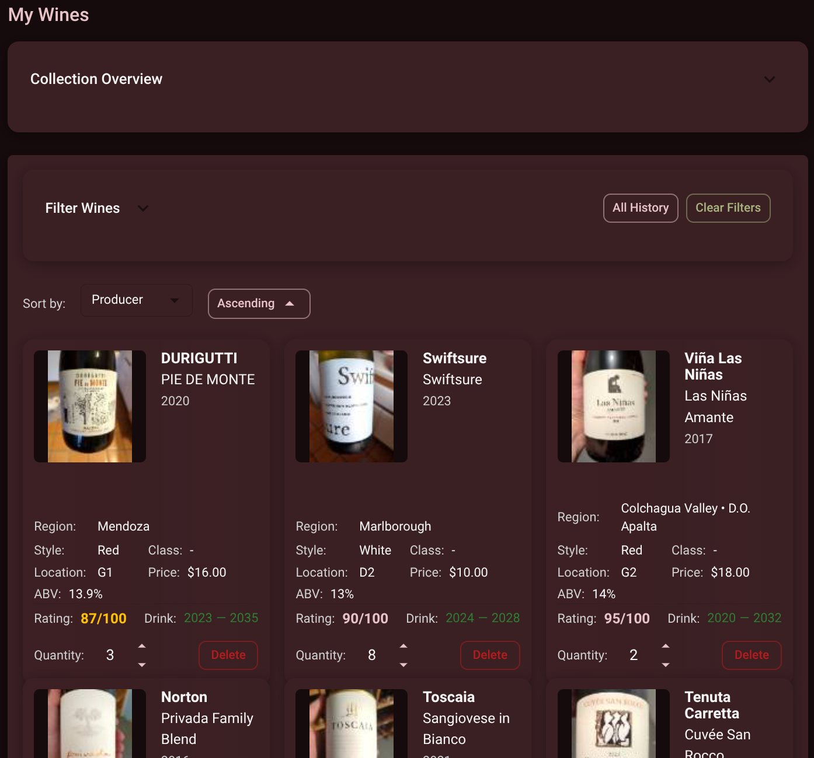
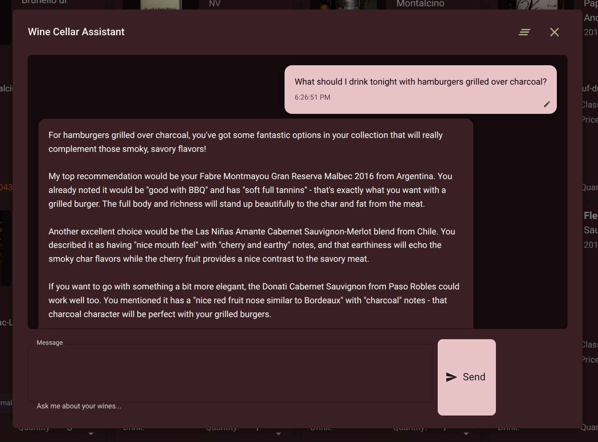

# 🍷 Wine Cellar App

A self-hosted wine collection management application built with Clojure and ClojureScript.


*Wine collection overview showing filtering, ratings, and inventory management*

## Features

### Wine Management
- **Track your collection** - Store detailed wine information (producer, vintage, region, style, etc.)
- **Smart search & filtering** - Find wines by name, region, style, price range, or tasting window
- **Physical location tracking** - Know exactly where each bottle is stored (A1, B2, C10, etc.)
- **Quantity & consumption tracking** - Monitor your inventory with easy +/- controls

### AI-Powered Features
- **Label analysis** - Upload wine label photos to automatically extract details
- **Drinking window suggestions** - Get AI recommendations for optimal drinking periods  
- **Wine chat** - Ask questions about your collection and get intelligent responses


*AI-powered wine assistant providing personalized recommendations based on your collection*

### Tasting & Notes
- **Tasting notes & ratings** - Record detailed notes with 1-100 ratings
- **Photo storage** - Upload front/back label images with automatic thumbnails
- **Grape variety management** - Associate wines with varieties and percentages

### Self-Hosted Benefits
- **Your data, your control** - No vendor lock-in or subscription fees
- **Complete privacy** - No data mining or external tracking
- **Customizable** - Modify features to fit your exact needs

## Quick Start

### Prerequisites
- Java 11+
- Node.js 18+
- PostgreSQL
- [pass](https://www.passwordstore.org/) password manager

### Setup
1. **Database Setup**
   ```bash
   ansible-playbook postgresql.yml
   ```

2. **Install Dependencies**
   ```bash
   npm install
   ```

3. **Configure Credentials** (see Credentials section below)

4. **Start Development Server**
   ```bash
   clj -M:dev-all
   ```

5. **Open** http://localhost:8080 (frontend) or http://localhost:3000 (backend API)

## Tech Stack
- **Backend**: Clojure, Ring, Reitit, HoneySQL, PostgreSQL
- **Frontend**: ClojureScript, Reagent (React), Material-UI  
- **AI**: Anthropic Claude API
- **Auth**: JWT with Google OAuth

### Credentials Management

#### Local Development

This application uses secure credential management:
- **Production**: Environment variables
- **Development**: [`pass`](https://www.passwordstore.org/) password manager

See [environment-variables.md](docs/environment-variables.md) for complete setup instructions and credential requirements.

## Deployment to Fly.io

### Prerequisites

1. Install the Fly.io CLI:
   ```
   curl -L https://fly.io/install.sh | sh
   ```

2. Login to Fly.io:
   ```
   fly auth login
   ```

### Deployment Steps

1. Create a Fly.io app:
   ```
   fly apps create wine-cellar
   ```

2. Create a PostgreSQL database:
   ```
   fly postgres create --name wine-cellar-db
   ```

3. Attach the database to your app:
   ```
   fly postgres attach --app wine-cellar wine-cellar-db
   ```

5. Deploy the application:
   ```
   fly deploy
   ```

6. Open the application in your browser:
   ```
   fly open
   ```

### CI/CD with GitHub Actions

This repository includes a GitHub Actions workflow that automatically deploys the application to Fly.io when changes are pushed to the main branch.

To set up CI/CD:

1. Create a Fly.io API token:
   ```
   fly auth token
   ```

2. Add the following secrets in your GitHub repository:
   - Go to your repository on GitHub
   - Navigate to Settings > Secrets and variables > Actions > Repository secrets
   - Create these repository secrets:

   | Secret Name | Description | Example |
   |-------------|-------------|---------|
   | `FLY_API_TOKEN` | Fly.io API token for deployment | `fo1_xxx...` |
   | `FLY_APP_NAME` | Your Fly.io app name | `my-wine-cellar` |
   | `FLY_PRIMARY_REGION` | Fly.io deployment region | `iad` |
   | `ANTHROPIC_MODEL` | Claude model to use | `claude-sonnet-4-20250514` |

3. The workflow uses `fly.toml.template` and generates the actual `fly.toml` during deployment using your secret values.

Now, whenever you push changes to the main branch, the application will be automatically deployed to Fly.io.

## Development Tools

### Wine Color Picker

The `tools/wine-color-picker/` directory contains utilities for extracting authentic wine colors from the Wine Folly color chart:

- **`web_color_picker.html`** - Interactive web-based color picker. Click on wine glasses to sample colors and generate Clojure color definitions.
- **`serve_color_picker.py`** - Web server to host the color picker tool
- **`wine-colors.jpg`** - Wine Folly color chart poster

#### Usage

1. Create and activate a Python virtual environment:
   ```bash
   python3 -m venv wine-color-env
   source wine-color-env/bin/activate  # On Windows: wine-color-env\Scripts\activate
   ```

2. Install Python dependencies:
   ```bash
   pip3 install -r tools/wine-color-picker/requirements.txt
   ```

3. Start the color picker server:
   ```bash
   python3 tools/wine-color-picker/serve_color_picker.py
   ```

4. Open the web interface and click on wine glasses to extract colors

5. When finished, deactivate the virtual environment:
   ```bash
   deactivate
   ```

The extracted colors are used in the wine color selection component (`src/cljs/wine_cellar/views/components/wine_color.cljs`) for accurate wine color representation in tasting notes.
